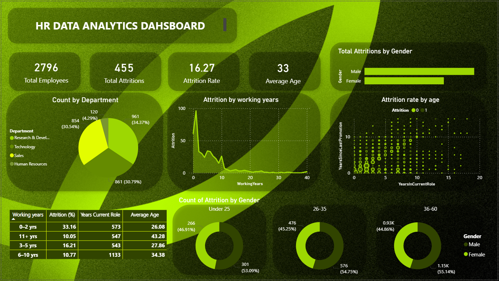
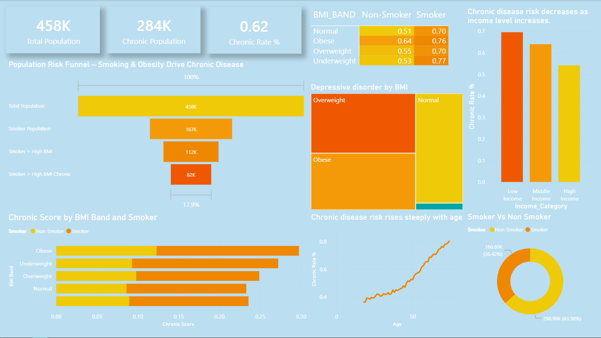

#  Data Analysis Portfolio

## About
My portfolio showcases a selection of hands-on data analysis projects focused on real-world problems. The work includes HR attrition analysis, where I explored factors influencing employee turnover, and healthcare-focused studies examining the relationship between sleep, cigarette smoking, and the rise of chronic conditions. Each project emphasizes practical data cleaning, exploratory analysis, and insight-driven storytelling, with a focus on turning raw data into clear, actionable conclusions.

## Table of content

**[HR Employee Attrition](#hr-employee-attrition)**  

**[Chronic Disease Risk Analysis](#chronic-disease-risk-analysis)** 

**[Personal details](#personal-details)**
 
 
## HR Employee Attrition
#### [Power BI Attrition Dashboard](HR_Attrition_Analysis.ipynb)

🔗 [View Interactive Dashboard](https://app.powerbi.com/groups/me/reports/26d0c0e1-b25a-4ece-99a2-83b2f24bc1de/424c8823459eb66f4017?experience=power-bi)
#### 🧰 Tools Used
pandas        – data manipulation  
numpy         – numerical computation  
matplotlib    – data visualization  
seaborn       – statistical plots  
scikit-learn  – machine learning models  
Power BI      – interactive dashboard & reporting

**Code:** Includes data cleaning, feature engineering, exploratory analysis, machine learning modeling, and visual storytelling using both Python and Power BI.

**Description:** The dataset comprises multiple variables that contribute to employee attrition analysis.

**Skills:** data cleaning, data analysis, correlation matrices, machine learning, DAX.

**Technology:** Python and its libraries along with Power BI for Visualization, Adobe Creative Suite for graphics.

**Results:** The analysis revealed that overtime, income level, and tenure are the strongest predictors of employee attrition.
Combining Power BI dashboards with Python machine learning enabled both descriptive and predictive insights, supporting data-driven HR retention strategies.

## Chronic Disease Risk Analysis
#### [Power BI Attrition Dashboard](Chronic_Disease_Risk_Analysis.ipynb)

🔗 [View Interactive Dashboard](https://app.powerbi.com/groups/me/reports/98de7472-4f5b-4bc2-92b2-d52604c9ee6c/7af304c85ea8e0399060?experience=power-bi)

#### 🧰 Tools Used
pandas        – data manipulation  
numpy         – numerical computation  
matplotlib    – data visualization  
seaborn       – statistical plots  
scikit-learn  – machine learning models  
Power BI      – interactive dashboard & reporting

**Code:** Includes data cleaning, feature engineering, exploratory analysis, machine learning modeling, and visual storytelling using both Python and Power BI.

**Description:** This project analyzes healthcare survey data to identify key factors influencing chronic disease risk. The dataset includes demographic, behavioral, socioeconomic, and health-related variables such as age, BMI, smoking status, physical activity, income, education, and diagnosed chronic conditions.

**Skills:** data cleaning, data analysis, correlation matrices, machine learning, DAX.

**Technology:** Python and its libraries along with Power BI for Visualization, Adobe Creative Suite for graphics.

**Results:** The analysis shows that age, smoking, and higher BMI significantly increase chronic disease risk, while physical activity acts as a protective factor. Socioeconomic factors such as income and education also influence disease burden. By combining Python-based machine learning with Power BI dashboards, the project is delivering both predictive insights and clear visual explanations, supporting data-driven public health and preventive care decisions.

## Personal details
#### **Contacts (UAE):** +971 507510579
#### **Email:** franklin.castelino95@gmail.com
#### **Date of Birth**	05th March 1995
#### **Languages**	English, Hindi, Marathi, Konkani

## Education
  -MSc in Data Science from Manipal Academy of Higher Education
  
  -Post Graduate Diploma (PGDM) in Commercial Shipping Management & Logistics from Narottam Morarjee Institute Of Shipping 
  
  -Bachelor of Science (BSc IT) Information Technology from Mumbai University   

